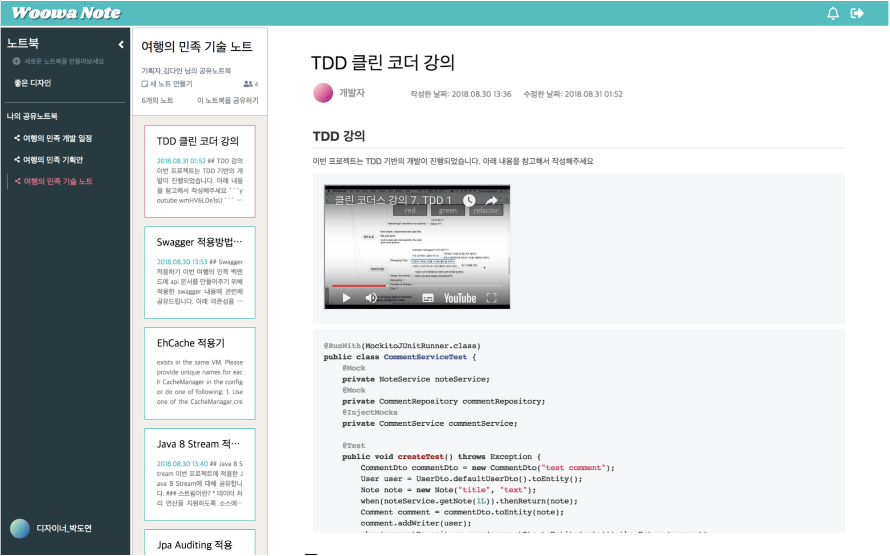
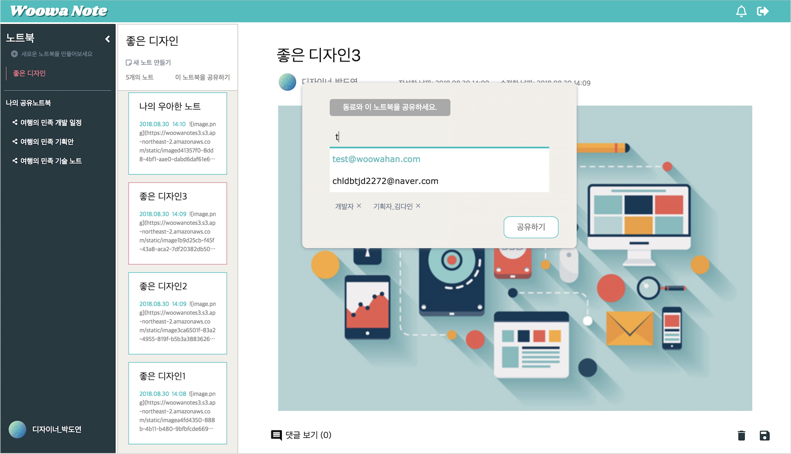
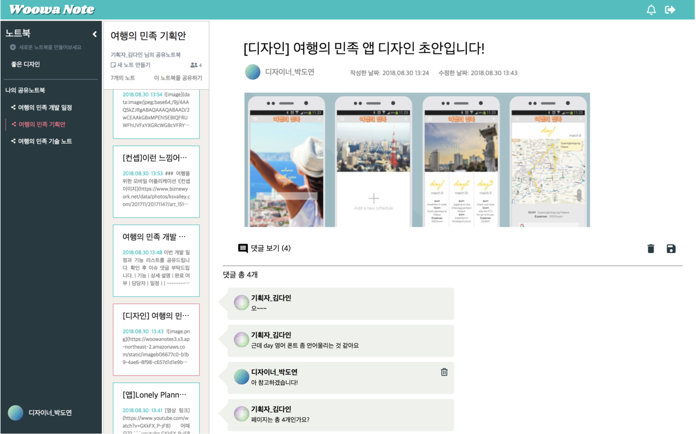

# WoowaNote 

### **WoowaNote**는 웹 기반의 노트로 강력한 에디터를 기반으로 동료와 아이디어를 효과적으로 공유할 수 있도록 도와줍니다.
  
## Feature
- **'마크다운'** 문법으로 **코드블럭, 이미지, 동영상**을 추가할 수 있어요.
  

- 동료를 노트북에 초대해서 함께 **공유**하고, **댓글**을 달 수 있어요.
- 공유 노트북에서 작성된 노트는 **실시간**으로 표시됩니다.
    

## Development Environment
- Java8, HTML, CSS, JavaScript
- Spring Boot
- Spring Data JPA
- MySQL
- GitHub
- Travis CI
- AWS EC2, S3, RDS, CodeDeploy
  
#
우아한테크캠프 2기 1팀 WannaOne [김규남](https://github.com/tramyu) [김다인](https://github.com/dain7672) [박도연](https://github.com/doooyeon) [형두호](https://github.com/dooho-h)