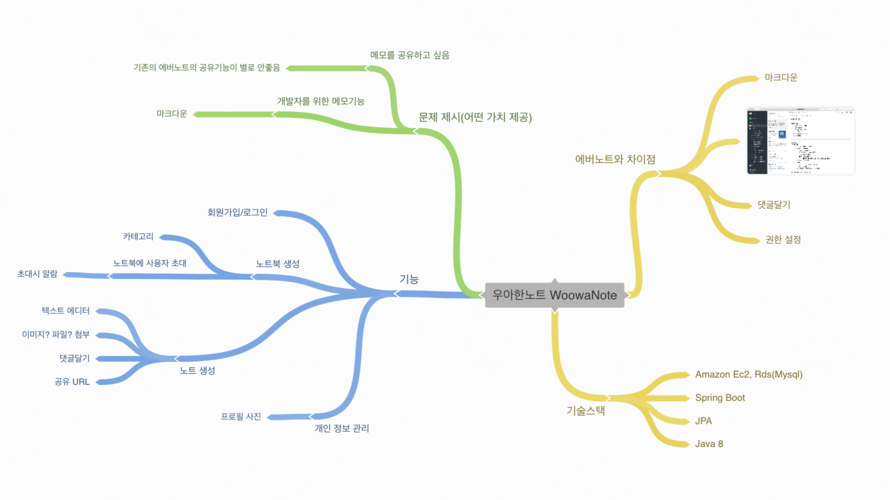

# Proposal 1단계

[mindmap link](https://coggle.it/diagram/W2Pd5pP-j-5e6LeG/t/%EC%9A%B0%EC%95%84%ED%95%9C%EB%85%B8%ED%8A%B8-woowanote)

## 구조
- 에버노트 형을 변형하기로 결정!
  - 에버노트 형 
    - 노트 - 노트북 - 스택
    - 정적임
  - 슬랙 형
    - 워크 스페이스 안에 여러 작은 채널
    - 동적임

## 에버노트와의 차이점
- 좀 더 협업을 편리하게 하고 (댓글 기능 / 공동 노트북)
- 권한 관리를 조금 더 편리하게 하고 (노트북/노트의 삭제 및 수정 권한)
- 마크다운 등을 지원

## 주요 기능 (단계별로 잘 구분해서 진행해보기)
- 개인별 노트 작성/관리
- 개별 노트 단위로 타인과 공유 / 댓글달기
  - 이메일 등으로 초대해서 권한을 주는 것
- 공동 노트북 기능
  - 개인 프로필 관리/설정하는 페이지
- 마크다운 등 텍스트 에디팅 기능
- 이미지 / 파일 첨부

## 여유가 있다면 도전해 볼 챌린징한 기능
- 공동 노트북에 새 글이 생성되면 알람
- 노트북 단위의 채팅
- 노트 동시 수정

## 계획
- 어려운 지점
  - 권한 관리가 복잡함 
  - 회원가입/로그인이 가장 어려울지도
- 코어 기능부터 하자 

## 협업
- 트렐로를 사용하자
- 일지를 github에 올려두자
